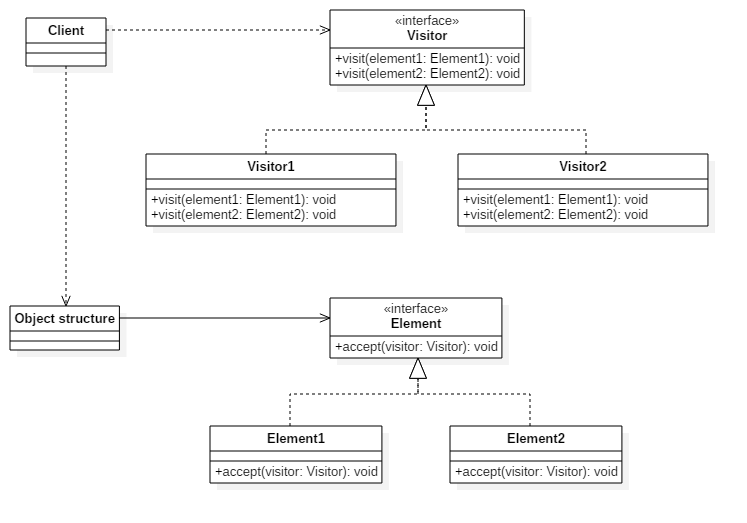

# 设计模式 - 访问者模式

> 一种将算法与对象结构分离的软件设计模式

---------------------------------------------------------

[Home Page](http://ashman.top) 

- From: 2017/09/19
- Author: 哎呦嘿哈
- Intro: fēi féi fèi

---------------------------------------------------------

- [1. 单分派与多分派](#1-单分派与多分派)
    - [1.1. 方法分派](#11-方法分派)
    - [1.2. 方法的宗量](#12-方法的宗量)
    - [1.3. 方法调用的接收者](#13-方法调用的接收者)
    - [1.4. 单分派与多分派的判断](#14-单分派与多分派的判断)
- [2. 访问者模式](#2-访问者模式)
    - [2.1. 访问者模式样例](#21-访问者模式样例)
    - [2.2. 模拟双分派实例](#22-模拟双分派实例)
- [引用](#引用)

---------------------------------------------------------

## 1. 单分派与多分派

> 访问者模式使得我们可以在传统的单分派（single-dispatch）语言（如Smalltalk、Java和C++）中模拟双分派技术。
> 对于支持多分派（multiple-dispathc）的语言（如CLOS），访问者模式已经内置于语言特性之中了，从而不再重要。

### 1.1. 方法分派

> 1.1 Method Dispatch

- **方法**：一个处理流程
- **输入**：该流程可以处理多种类型，不同数量的输入，对应方法参数的不同
- **本质**：无论输入如何，依旧是同一种处理流程
- **意图**：如果能用同样的名字来命名这个方法，会有助于程序代码清晰的表达出语义
- **问题**：使用相同的方法名，则要解决选用同名方法哪个版本的问题
    - 编译时由编译器选择
    - 运行时进行**方法分派**

#### 编译时

> 重载（Overload）：编译器只会根据静态变量的类型来判断选择哪个版本的重载

参数的数量、类型等信息组成了函数的signature，使用同一个名字来命名signature不同的函数，
称为函数重载（function overloading）。

函数重载是编译时概念。参数类型是由变量声明的类型所决定的。
通过函数的signature，编译器已经有足够信息来判断应该采用哪个版本的foo()。 

```java
class Foo {
    public void foo(int i) {
        System.out.println(i);
    }
    
    public void foo(int i, int j) {
        System.out.println(i + j);
    }
    
    public void foo(String s) {
        System.out.println(s);
    }
}
```

#### 运行时

> 覆盖（Override）：根据值的实际类型来判断

同一个继承链上的不同类型可以拥有signature相同的虚方法，表现出多态。
从语义上说，在编译时无法判断一个虚方法调用到底应该采用继承链上signature相同的哪个版本，
所以要留待运行时进行分派（dispatch）。

```java
class A {
    public void foo(int i) {
        System.out.println(i);
    }
}

class B extends A {
    @Override
    public void foo(int i) {
        System.out.println(i + 1);
    }
}

public class Program {
    public static void main(String[] args) {
        A b = new B();
        b.foo(0); // 1
    }
}
```

### 1.2. 方法的宗量

> **方法的接收者** 和 **方法的参数** 统称为方法的宗量。 

- 根据分派基于宗量多少（接收者是一个宗量，参数是一个宗量），可以将分派分为单分派和多分派。
    - 单分派是指根据一个宗量就可以知道调用目标（即应该调用哪个方法）。
    - 多分派需要根据多个宗量才能确定调用目标。

### 1.3. 方法调用的接收者

> 面向对象语言中经常会对函数调用的 **第一个参数** 做特殊处理，包括语法和语义都很特别。

- 语法：第一个参数不用写在参数列表，而是写在某种特殊符号之前（p.baz()的“.”），作为隐含参数。
- 语义：第一个参数被称为方法调用的接收者（receiver）。

```
Parent p = new Child();
p.baz(); // p为方法baz调用的接收者
```

- 接收者（宗量1）的 **实际类型** 会参与到方法分派的判断中，而其余的参数（宗量2）
    - 只参与 **静态类型** 判断，则为 **单一分派** + **方法重载**。
    - 以 **实际类型** 参与到方法分派的判断，则为 **多分派**。 

- 实际类型与静态类型

```
// Child 实际类型
// Parent 静态类型
Parent p = new Child(); 
```

### 1.4. 单分派与多分派的判断

```java
class Parent {}

class Child extends Parent {}

class Foobar {
    public void baz(Parent p1, Parent p2) {
        System.out.println("ParentParent");
    }

    public void baz(Parent p, Child c) {
        System.out.println("ParentChild");
    }

    public void baz(Child c1, Child c2) {
        System.out.println("ChildChild");
    }
}

public class Foo extends Foobar {
    @Override
    public void baz(Parent p1, Parent p2) {
        System.out.println("PP");
    }

    @Override
    public void baz(Parent p, Child c) {
        System.out.println("PC");
    }

    @Override
    public void baz(Child c1, Child c2) {
        System.out.println("CC");
    }
}
```

#### 调用方法的接收者可以有如下三种情况的声明

```
Foobar foobar = new Foobar(); // 实际类型：Foobar
Foo foo = new Foo(); // 实际类型 Foo
Foobar bar = new Foo(); // 实际类型 Foo
```

- 通过 `foobar` 调用 `baz` 方法打印的结果是 `ParentParent` 这一类的输出
- 通过 `foo` 和 `bar` 调用 `baz` 方法打印的结果均为 `PP` 这一类的输出
- 调用方法后的输出，与方法接收者的实际类型有关
- **结论** 方法接收者的 **实际类型** 参与到了方法分派之中

#### 类似的，方法参数也可以有如下三种情况的声明

```
Parent p = new Parent(); // 实际类型：Parent
Parent pc = new Child(); // 实际类型：Child
Child c = new Child(); // 实际类型：Child

foobar.baz(p, p); // ParentParent
foobar.baz(p, pc); // ParentParent >>> pc 的实际类型并没有影响到方法的执行结果
foobar.baz(p, c); // ParentChild
```

- **结论** Java参数的实际类型并不会参与到方法分派，仅有参数的静态类型对调用结果产生了影响
    - Java是一种单分派语言
    - 多分派语言，则可以根据参数的实际类型进行方法的调用

---------------------------------------------------------

## 2. 访问者模式

> 访问者模式（Visitor Pattern）是GoF提出的23种设计模式中的一种，属于行为模式。
> 表示一个作用于 **某对象结构** 中的 **各元素** 的操作。
> 通过访问者模式，可以在不改变各元素类的前提下定义作用于这些元素的新操作。

### 2.1. 访问者模式样例

> 被访问元素（Element）、访问者（Visitor）



[Download UML File](mdj/visitor_pattern.mdj)

#### 被访问元素 Element

```
public interface Element {
    String info();
    void accept(Visitor visitor);
}

class Element1 implements Element {

    @Override
    public String info() {
        return "Element1";
    }

    @Override
    public void accept(Visitor visitor) {
        visitor.visit(this);
    }
}

class Element2 implements Element {

    @Override
    public String info() {
        return "Element2";
    }

    @Override
    public void accept(Visitor visitor) {
        visitor.visit(this);
    }
}
```

#### 访问者 Visitor

```
public interface Visitor {
    void visit(Element1 element1);
    void visit(Element2 element2);
}

class Visitor1 implements Visitor {

    @Override
    public void visit(Element1 element1) {
        System.out.println("Visitor1 " + element1.info());
    }

    @Override
    public void visit(Element2 element2) {
        System.out.println("Visitor1 " + element2.info());
    }
}

class Visitor2 implements Visitor {

    @Override
    public void visit(Element1 element1) {
        System.out.println("Visitor2 " + element1.info());
    }

    @Override
    public void visit(Element2 element2) {
        System.out.println("Visitor2 " + element2.info());
    }
}
```

#### 使用

```
public class Client {
    public static void main(String[] args) {
        Element e1 = new Element1();
        Element e2 = new Element2();

        Visitor v1 = new Visitor1();
        Visitor v2 = new Visitor2();

        e1.accept(v1); // Visitor1 Element1
        e1.accept(v2); // Visitor2 Element1

        e2.accept(v1); // Visitor1 Element2
        e2.accept(v2); // Visitor2 Element2
    }
}
```

#### 总结

- `element.accept(visitor);`
    - element 为接收者，accept方法分派到element的实际类型

- `visitor.visit(this);` in accept method
    - visitor 为接收者，visit方法分派到visitor的实际类型
    - this 为方法参数，在Java中根据其静态类型进行方法调用

- **总结一**
    - 通过 **访问者模式** 的第一步 `element.accept(visitor);` 操作，已经定位出element的实际类型
    - 因此第二步操作中的 `visitor` 和 `this` 均为实际类型
    - 通过 **实际类型** Visitor中重载的各个visit方法便可以被“准确”调用（以实际类型调用）
    - 这便实现了 **模拟双分派**

- **总结二**
    - 访问者模式把 **数据结构** 和作用于结构上的 **操作** 解耦合，使得操作集合可相对自由地演化。
    - 访问者模式适用于 **数据结构相对稳定** 以及 **算法易变化**的系统。
        - 修改数据结构，则需要对Visitor的整个继承体系进行修改
        - 修改对element的操作只需要增删改对应特定操作的Visitor子类即可

- **总结三** 访问者模式适用场景
    - **需求** 为一个现有的类增加新功能，需要考虑到以下问题
        - 新功能会不会与现有功能出现兼容性问题？
        - 以后会不会再需要添加？
        - 如果类不允许修改代码怎么办？
    - **应对** 面对这些问题，最好的解决方法就是使用访问者模式，将数据结构与算法解耦，


### 2.2. 模拟双分派实例

> 通过访问者模式，在单分派语言Java中模拟双分派技术

#### 访问目标

> 一个由许多对象构成的对象结构，这些对象的类都拥有一个accept方法用来接受访问者对象；

- 上面栗子中的 `Parent && Child` 便可改造为一组访问目标

```
class Parent {
    public String accept(FoobarVisitor visitor) {
        return visitor.visit(this);
    }
}

class Child extends Parent {
    @Override
    public String accept(FoobarVisitor visitor) {
        // 注意此方法必须重写，否则this将无法指代Child的一个实例
        return visitor.visit(this);
    }
}
```

#### 访问者

> 访问者是一个接口，它拥有一个visit方法，这个方法对访问到的对象结构中不同类型的元素作出不同的反应；

```
class FoobarVisitor {

    public String visit(Parent parent) {
        return "Parent";
    }

    public String visit(Child child) {
        return "Child";
    }
}

class FooVisitor extends FoobarVisitor {
    @Override
    public String visit(Parent parent) {
        return "P";
    }

    @Override
    public String visit(Child child) {
        return "C";
    }
}
```

#### 通过访问者调用目标对象

```
class Foobar {
    private FoobarVisitor foobarVisitor = new FoobarVisitor();

    public void baz(Parent p1, Parent p2) {
        System.out.println(p1.accept(foobarVisitor) + p2.accept(foobarVisitor));
    }

    public void baz(Parent p, Child c) {
        System.out.println(p.accept(foobarVisitor) + c.accept(foobarVisitor));
    }

    public void baz(Child c1, Child c2) {
        System.out.println(c1.accept(foobarVisitor) + c2.accept(foobarVisitor));
    }
}

public class Foo extends Foobar {
    private FoobarVisitor foobarVisitor = new FooVisitor();

    @Override
    public void baz(Parent p1, Parent p2) {
        System.out.println(p1.accept(foobarVisitor) + p2.accept(foobarVisitor));
    }

    @Override
    public void baz(Parent p, Child c) {
        System.out.println(p.accept(foobarVisitor) + c.accept(foobarVisitor));
    }

    @Override
    public void baz(Child c1, Child c2) {
        System.out.println(c1.accept(foobarVisitor) + c2.accept(foobarVisitor));
    }
    
    public static void main(String[] args) {
        Foobar foobar = new Foobar(); // 实际类型：Foobar
        Foo foo = new Foo(); // 实际类型 Foo
        Foobar bar = new Foo(); // 实际类型 Foo

        Parent p = new Parent(); // 实际类型：Parent
        Parent pc = new Child(); // 实际类型：Child
        Child c = new Child(); // 实际类型：Child

        foobar.baz(p, p); // ParentParent
        foobar.baz(p, pc); // ParentChild
        foobar.baz(p, c); // ParentChild
    }
}
```

- 首先，根据前文 `foobar.baz(p, pc);` 可定还是调用的方法 `void baz(Parent p1, Parent p2)` 
- 但是，因为在方法内部使用了 `p2.accept(foobarVisitor)`，p2被分配到实际类型
- 然后在 `accept` 方法中 `foobarVisitor.visit(this)`，foobarVisitor也被分配到了实际类型
- 因此最后输出为 `ParentChild`，与之前不同，实现了模拟的双分派，基于方法接收者与方法参数

-------------------------------------------------------

## 引用

- [方法分派（method dispatch）的几个例子](http://rednaxelafx.iteye.com/blog/260206)
- [java方法调用之单分派与多分派（二）](http://blog.csdn.net/fan2012huan/article/details/51004615)
- [访问者模式](https://zh.wikipedia.org/wiki/%E8%AE%BF%E9%97%AE%E8%80%85%E6%A8%A1%E5%BC%8F)
- [Java开发中的23种设计模式详解(转)](http://www.cnblogs.com/maowang1991/archive/2013/04/15/3023236.html)

-------------------------------------------------------
